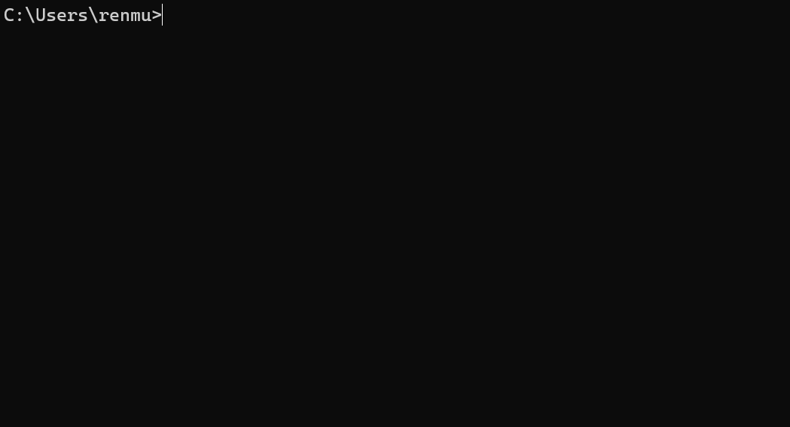

# 简介

你还在担心你关注的 up 主被删视频吗？这个工具帮助你来自动下载备份视频。

你也可以通过[视频](https://www.bilibili.com/video/BV1u94y1K7nr)来进行入门

# 安装

`npm install @renmu/bili-cli -g`

# 使用


如果你想下载高画质视频，请登录，登录请运行`bili login`。  
下载有两种模式，如果你设置了`ffmpegBinPath`参数，会采用 dash 流模式，该模式的画质更高，支持编码等参数选择。  
如果你没有设置`ffmpegBinPath`参数，登录情况下视频的分辨率大概最大是 720p。

更多使用见`help`命令

## 订阅

### 添加订阅

`bili sub add 10995238`

### 移除订阅

`bili sub remove 10995238`

### 下载订阅

`bili sub download`

### 定时运行订阅

默认十分钟运行一次
`bili sub server`

## 下载

`bili download https://www.bilibili.com/video/BV1u94y1K7nr`

# 文档

```bash
Usage: bili [options] [command]

b站命令行

Options:
  -V, --version                output the version number
  -h, --help                   display help for command

Commands:
  login                        登录b站账号
  download [options] [url]     下载视频
  subscribe|sub                订阅
  config                       配置项
  help [command]               display help for command
```

```bash
Usage: bili subscribe|sub [options] [command]

订阅

Options:
  -h, --help       display help for command

Commands:
  download          下载订阅
  add <number>      添加一个up主到订阅
  remove <number>   移除一个订阅的up主
  list              显示所有订阅
  server [options]  定时运行sub命令，默认十分钟运行一次
```

## 配置

支持的配置项有：

1. `downloadPath`: 下载路径，默认为`~/.bili-cli/videos`
2. `ffmpegBinPath`: ffmpeg 可执行文件路径，默认使用当前文件夹及环境变量
3. `logLevel`: log 等级，支持 error,warn,info,debug

```bash
Usage: bili config [options] [command]

配置项

Options:
  -h, --help             display help for command

Commands:
  print                  显示配置项
  set <string> <string>  设置配置项
  help [command]         display help for command
```

# 赞赏

如果本项目对你有帮助，请我喝瓶快乐水吧，有助于项目更好维护：[https://afdian.net/a/renmu123](https://afdian.net/a/renmu123)

# 开发

api 基于[biliApi](https://github.com/renmu123/biliAPI)
node 需要 18 及以上版本

## Install

```bash
$ pnpm install
```

## Development

```bash
$ pnpm run dev
```

## Build

```bash
$ pnpm run build
```

# License

GPLv3
